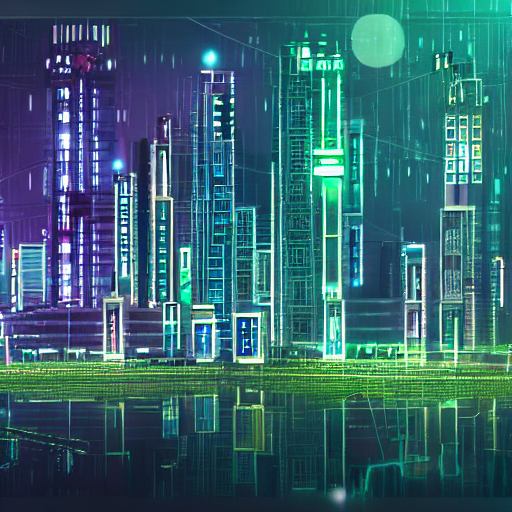

# 🧠 PromptForge-AI

**PromptForge-AI** is a full-stack AI-powered text-to-image generation system that lets you prompt stunning visuals using a sleek ChatGPT-style frontend. It's powered by [Stable Diffusion v1.5](https://huggingface.co/runwayml/stable-diffusion-v1-5), integrated with a Django backend, and backed by persistent prompt history — both in a database and JSON.

> Imagine your ideas — visualized instantly with Tesla-class GPU acceleration.

---

## 📸 Demo

  
*Prompt: "A futuristic Tesla AI lab surrounded by neon-lit cityscapes"*

---

## 🚀 Features

- 🖼️ Generate images from text using `StableDiffusionPipeline`
- 🧠 Store prompt + image history in both SQLite and JSON
- 🗂️ Auto-serve generated images with unique filenames
- 💬 ChatGPT-style interface using Tailwind CSS
- 🧾 Backend APIs to generate & fetch history
- ⚙️ Deployed and powered by 2× V100 GPUs (64GB total)

---

## 🧰 Tech Stack

| Layer         | Tech                          |
|---------------|-------------------------------|
| Frontend      | HTML + Tailwind CSS (Tesla UI)|
| Backend       | Django 5.2 (API server)       |
| AI Model      | `runwayml/stable-diffusion-v1-5` via `diffusers` |
| Database      | SQLite (Django ORM)           |
| Storage       | JSON + media/ images          |
| Infra         | Python 3.12, Conda, V100 GPU  |

---

## 🛠️ Installation

### 1. Clone the repository

```bash
git clone https://github.com/yourname/neurodiffusion.git
cd neurodiffusion
```

### 2. Create environment

```bash
conda env create -f stable_diff_env.yml
conda activate stable_diff
```

### 3. Run database setup

```bash
python manage.py makemigrations
python manage.py migrate
```

### 4. Start the server

```bash
python manage.py runserver 0.0.0.0:8000
```

> Visit `http://localhost:8000` to access the UI.

---

## 📂 Project Structure

```
neurodiffusion/
├── backend/              # Django project settings
├── chatapi/              # Django app: APIs, models, views
├── media/                # All generated images + history.json
├── templates/index.html  # Tesla-style UI
├── stable_diff.py        # AI model loading & image generation
├── stable_diff_env.yml   # Conda environment
├── manage.py
```

---

## 🧪 API Usage

### `POST /api/generate-image/`

```json
{
  "prompt": "A steampunk flying train in the clouds"
}
```

Returns:
```json
{
  "image_url": "/media/steampunk_flying_train_20250505182211.png"
}
```

### `GET /api/history/`

Returns:
```json
{
  "history": [
    {
      "prompt": "A spaceship over Mars",
      "image_url": "/media/spaceship_over_mars_20250505180000.png",
      "timestamp": "20250505180000"
    }
  ]
}
```

---

## 🎨 Frontend Overview

- Prompt box submits to `/api/generate-image/`
- History is dynamically loaded from `/api/history/`
- Images are rendered on selection
- Stored in `media/history.json` and SQLite

---

## 📦 Dependencies

Saved under:
```bash
stable_diff_env.yml
```

Contains:
- `django==5.2`
- `diffusers`
- `transformers`
- `torch` + `torchvision` (with CUDA 12.1)
- `safetensors`, `accelerate`
- `python=3.12`

---


## 🙌 Acknowledgements

- 🤗 Hugging Face's `diffusers`
- Tesla V100 GPUs for powering dreams
- Tailwind CSS for sleek UI